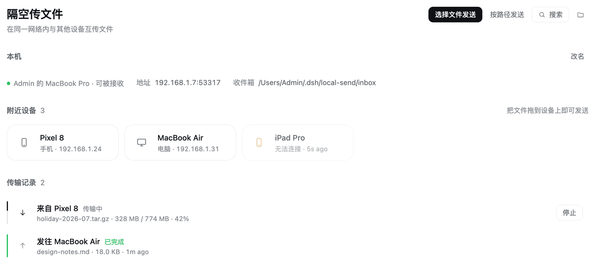
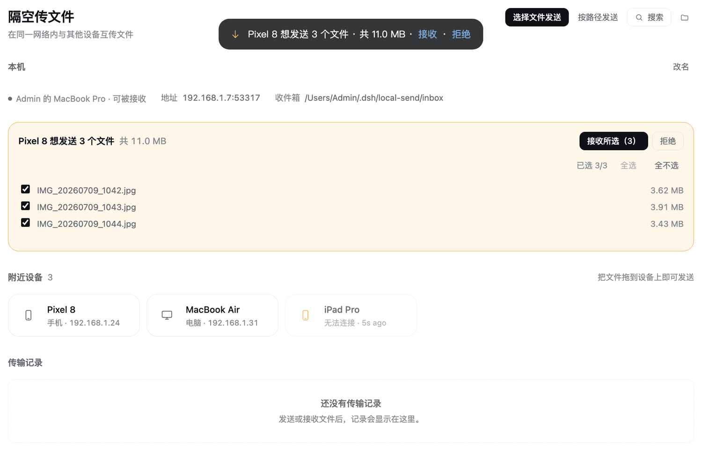
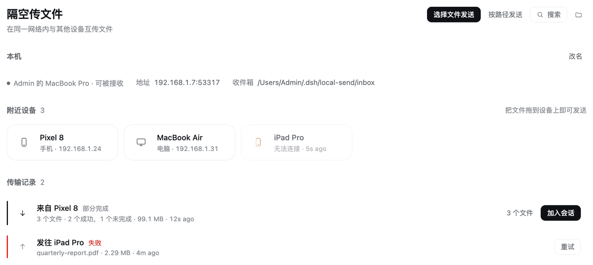

# dsh-local-send

在 DeepSeek Harness 里和同一内网的其他设备互传文件——手机、另一台电脑、别人的机器，只要跑着 [LocalSend](https://github.com/localsend/localsend) 或本插件都行。收到的文件落在本机磁盘上，一键就能变成会话里的 `@路径` 引用，让 Agent 直接读它。



- **和官方 LocalSend 互通。** 实现 LocalSend 协议 v2.2：手机上的官方 App 能发现你这台电脑、直接把照片发过来，不需要两边都装插件。
- **不经过云、不落中转盘。** 字节在局域网内直通对端；插件自己的两个半边之间也不写临时文件中转。
- **收之前先问过你。** 默认每次传入都要人工确认，还能**逐文件勾选**——只收你想要的那几个，其余在协议层面被拒。
- **收完直接给 Agent。** 点「加入会话」，文件路径以 `@引用` 形式插进输入框草稿，Harness 里的 Agent 就能读这个文件。

---

## 目录

- [能做什么](#能做什么)
- [安装](#安装)
- [怎么用](#怎么用)
- [与官方 LocalSend 的兼容性](#与官方-localsend-的兼容性)
- [配置](#配置)
- [安全说明](#安全说明)
- [常见问题](#常见问题)
- [已知限制](#已知限制)
- [开发](#开发)

---

## 能做什么

### 收发文件

三种发送方式，按场景挑：

| 方式 | 适合 | 说明 |
|---|---|---|
| **拖拽** | 手边有文件、图快 | 把文件拖到「附近设备」里的设备磁贴上，松手即发。拖到面板空白处也行：只有一台设备就直接发给它，有多台时把文件搁下让你选 |
| **选择文件** | 从文件管理器挑 | 点「选择文件发送」走系统文件对话框 |
| **按路径** | 大文件、workspace 里的文件 | 直接填本机绝对路径（每行一个），从磁盘流式发送，不经过浏览器内存 |

进度是传输行的左边缘（结构而非装饰），实时数字用等宽字体。发到一半可以**停止**：不是只改个标签，而是真的中止在途请求。

### 逐文件接收

传入的一批文件里，你可以只勾其中几个：



这不是前端假装的筛选。协议的 `prepare-upload` 响应本来就是「一个文件一个 token」，插件真的只给勾中的文件发 token，其余在响应里缺席——而"某个文件不在 token map 里"正是协议表达单文件拒绝的方式。所以取消勾选是**协议层面**的拒收。

90 秒内没有任何操作，等同于拒绝（发送方会收到 `403`，知道是人没理它，不是网络出问题）。

### 把收到的文件交给 Agent

文件落到收件箱后，传输记录上会出现「加入会话」：



按下它，文件路径作为 `@路径` 引用插进当前会话的输入框——**只插引用，不发消息**。插完发不发、说什么，仍然是你的动作。它也不会覆盖你已经输入的内容。

### 传输状态一直在眼前

不用切面板也知道发生了什么：

| 界面 | 在哪 | 干什么 |
|---|---|---|
| **隔空传文件**面板 | 左侧边栏 → 主区域 | 看附近设备、发送、看进度、逐文件决定收哪些、把收到的文件加进会话 |
| **右键发送** | 全窗口任意位置 | 在文件树、会话里的 `@文件` 引用、文档预览上右键，就地弹出「隔空发送到 <设备>」 |
| **小鱼同伴** | 会话标题栏右侧 | 传输的存在感：空闲时不在，有文件等你时叼着文件出现，传输时鱼鳍扫动加一圈进度环，完成后甩尾，余温过去就退场 |
| **接收横幅** | 输入框上方整行 | 正在打字时有人发文件，就在你和你要发的东西之间问你一次 |
| **接收提醒** | 全局浮层（顶部居中） | 切到任何面板都会弹出的通知，带「接收 / 拒绝」 |
| **输入框钩子** | 会话输入框 | 「加入会话」按下后把 `@路径` 插进草稿 |

小鱼同伴**只在有事时出现**（有待确认的 offer、有传输在途、或有刚结束的传输），不是变暗留着。

### 右键发送

DSH 没有给插件用的右键菜单扩展点，所以这个菜单是插件自己挂的——用产品自己的 `Menu` 组件渲染，因此键盘走查、Escape 关闭、失焦关闭、焦点归还都是现成的。它靠 DSH 渲染的三处 DOM 标记认出「用户右键的是哪个文件」；**认不出就什么都不做**，不 `preventDefault`，所以在别处右键的行为和没装这个插件时一模一样。

菜单里的动作：发到某台设备、加入会话、在文件夹中显示（仅限收件目录里的文件）、复制路径。**文件夹不给发送入口**——插件不发送文件夹，与其让它绕一圈回来报「不是普通文件」，不如当场说清楚。

---

## 安装

前置：一个能跑的 DeepSeek Harness（桌面版），以及和你目标设备在同一个局域网内。

### 1. 加进 profile

编辑 `~/.dsh/profiles/desktop/package.json`：

```json
{
  "dsh": {
    "profile": {
      "bundles": [
        "@deepseek-ai/dsh-base",
        "@deepseek-ai/dsh-web-app",
        "dsh-local-send"
      ]
    }
  },
  "dependencies": {
    "dsh-local-send": "^0.1.0"
  }
}
```

两个地方都要加：`bundles` 决定 Loader 会不会挂载它，`dependencies` 决定包里有没有这份代码。

从源码仓库开发时，把依赖换成 `"dsh-local-send": "link:/绝对路径/dsh-plugins/dsh-local-send"`。

### 2. 安装依赖

```bash
cd ~/.dsh/profiles/desktop
pnpm install
```

### 3. 重启 Harness

host 半边的代码没有文件监听，改动后需要重启才会生效。

**不想重启的话**：在侧边栏的 **Plugins** 面板里把 `dsh-local-send` 关掉再打开。`setPluginEnabled` 会返回 `applied`（运行时已生效）或 `restart-required`，面板会在后者时明确显示「更改将在下次启动生效」。

### 装好之后核对一下

```bash
node ~/.dsh/profiles/desktop/node_modules/dsh-local-send/scripts/verify.mjs
```

它会对着**运行中的** Harness 检查十二件事，其中这几件只有真跑起来才能验证：

| 检查 | 证明了什么 |
|---|---|
| 传输 API 在监听 | host 半边真的激活了，而不只是被读到了 |
| 组播主动广播被听到 | 别的设备能发现你 |
| 收到广播后回拨 `/register` | 你能发现别人 |
| 端口归属 | 53317 上确实是 Harness 进程 |

后两项用一个**临时的假 LocalSend 对端**完成：它在组播组里广播自己然后等着被回拨。这不需要 Harness 的凭据，也不需要人工点确认。

> 唯一会 FAIL 的那项是「client bundle is served」——它在**没带凭据**时拿 404，装没装好都一样，别把它当成失败信号。真正说明问题的是「传输 API 在监听」和「端口归属」。

### 卸载

从 `bundles` 和 `dependencies` 里删掉那两行，`pnpm install`，然后重启（或在 Plugins 面板里关掉）。**收件箱里的文件不会被删。**

一个坑：`pnpm install` **不会**清掉 `node_modules` 里那个孤悬的符号链接（用 `link:` 装的时候）——它不属于 pnpm 的依赖图，pnpm 不动它。清单删干净、`pnpm-lock.yaml` 里也搜不到了，链接却还在，插件就还可能被读到。卸载后核对一下：

```bash
ls ~/.dsh/profiles/desktop/node_modules/ | grep local-send
# 有输出就手动 rm 那个链接
```

---

## 怎么用

### 发文件

打开侧边栏的「隔空传文件」，**附近设备**里会列出局域网内所有 LocalSend 设备（官方 App 也在这里）。然后拖文件上去、点「选择文件发送」、或点「按路径发送」填绝对路径。

面板顶部写着本机的状态：设备名、地址、收件箱路径。设备名可以点「改名」当场改（存在 `device.json` 里）。

### 收文件

有人发文件给你时，**顶部会弹出通知**（带接收/拒绝），正在打字的话**输入框上方**还会出现一条横幅，面板里也会展开待确认的文件清单。三处都可以操作，勾掉不想要的，点「接收所选」。

### 收完给 Agent

传输记录里点「加入会话」。需要当前有打开的会话；没有时会提示「请先打开一个会话」，并且**不切换面板**，而不是把你甩到一个空白新会话页上。

### 找不到设备？

点「搜索」做一次子网扫描。这是**手动**动作，不做定时——它要为子网里每个地址发一个请求，不该自动跑。正常情况下组播每 3 秒广播一次，设备会在几秒内自己出现。

---

## 与官方 LocalSend 的兼容性

实现了 LocalSend 协议 **v2.2** 的这部分：

**发现**
- 组播 `224.0.0.167:53317`，每 3 秒广播一次自身，TTL 1，开启环路（同机多实例也能互相发现）
- 收到 `announce: true` 后，用 HTTP `POST /api/localsend/v2/register` 回拨；回拨失败则退回组播应答（`announce: false`）
- 按 `fingerprint` 抑制自发现；对端 18 秒不再广播即从列表移除
- 多网卡逐个加入组，并按接口切换组播出口

**接收（本机作为服务端）**
- `POST /register`、`GET /info`、`POST /prepare-upload`（含 `?pin=`）、`POST /upload`、`POST /cancel`
- 状态码与错误体按参考实现：错误一律 `{"message": "..."}`，`204` 表示"无需传输"，校验和不符为 `422`，PIN 错 3 次后该地址 `429`
- upload token 与来源 IP 绑定，且只在用户接受后才生成——不存在"猜中 session id 就能用"的窗口
- 用户取消一个传入传输会**立刻让该会话的 token 全部失效**，并且正在写入的请求被直接断掉

**发送（本机作为客户端）**
- `prepare-upload` → 并发 2 路上传 → 失败时 `cancel` 撤回
- 文件 ≤ 256 MiB 时在 offer 里带 SHA-256；更大的文件跳过（要多读一遍全盘，而单段 LAN 的完整性已由传输层保证）
- 取消**真的中止在途请求**（`fetch` 直接读 `AbortController` 的 signal）
- **重试只对「按路径发送」开放**：拖进来的文件是一次活的请求体，传输结束就不存在了，无从重发；路径发送可以按需重新从磁盘读取

**没有实现**
- **HTTPS / 自签证书**。本插件广播 `protocol: "http"`，靠 `fingerprint` 用随机串标识自己——这正是协议为「不能出示可信证书的设备」预留的路径，官方 App 会照 `protocol` 字段用明文 HTTP 通信。代价见[安全说明](#安全说明)。
- **反向下载 API**（`prepare-download` / `download`）。它的用途是让浏览器从没有 LocalSend 的设备拉文件；本插件的面板直接和自己的 host 通信，不需要它，所以如实广播 `download: false`。
- **分片 / 断点续传**。协议本身没有，中断只能重新开一个 session 从头发。

> 顺带一提：[`localsend/web`](https://github.com/localsend/web) 现在是 **WebRTC-only**（协议 2.3），并不实现上面这套 HTTP 协议。本插件的协议实现是照着 [`localsend/protocol`](https://github.com/localsend/protocol) 规范和官方 App 的 Rust core 写的。

---

## 配置

装好即可用，所有字段都有默认值。要改就在 profile 的 `cordis.patch.yml` 里按 id 覆盖：

```yaml
- id: local-send
  name: '@deepseek-ai/dsh-local-send'
  config:
    alias: '我的 Mac'          # 对外显示的设备名；留空则用面板里改过的名字
    port: 53317               # 协议默认端口
    deviceType: desktop       # mobile | desktop | web | headless | server
    autoAccept: false         # true = 不询问直接收
    pin: ''                   # 非空则要求发送方带 ?pin=
    maxFileBytes: 17179869184      # 单文件 16 GiB
    maxTransferBytes: 68719476736  # 单次 64 GiB
    maxFiles: 500
    receiveDir: ''            # 留空 = ~/.dsh/local-send/inbox
```

> 提示：patch 会**整体替换**该行的 `config`，所以改的时候要把想保留的键一起写上。

**文件位置**（都在 `$DSH_HOME` 或 `~/.dsh` 下）

```
local-send/
├── device.json     # 设备名 + fingerprint（删掉会换一个新身份，对端会当成新设备）
└── inbox/          # 收到的文件
    └── .partial/   # 传输中的临时文件
```

---

## 安全说明

**传输是明文的。** 局域网内任何能嗅探流量的人都看得到文件内容。这是本插件为了「不需要生成和分发自签证书、装完即用」而做的取舍，也是协议 `protocol: "http"` 字段存在的意义——但不是零代价，请自行判断是否接受。

减轻风险的部分：

- 所有进入的传输**默认必须人工确认**（`autoAccept` 可关）
- 可设 PIN，错 3 次该地址被拒
- upload token 与发出 offer 的 IP 绑定，token 只在对端接受后才生成
- 用户取消一个传入传输会立刻让该会话的 token 全部失效：已经拿到 token 的发送方不能再写进一个用户刚刚拒收的文件，而且正在写入的那个请求会被直接断掉
- 文件名按**单一路径段**校验（拒绝 `.`、`..`、含分隔符或控制字符），先写随机名到 `.partial/` 再改名——路径穿越没有落点，而不是事后过滤
- 单文件 / 单次传输 / 文件数三重上限，在**读第一个字节之前**就按元数据筛掉

**面板侧。** 「加入会话」只做一件事：把收到的文件路径作为 `@路径` 引用插进输入框，不发送任何消息。

---

## 常见问题

**对方看不到我 / 我看不到对方？**

先确认在同一个网段、且都没开"客户端隔离"（很多公共 Wi-Fi 和访客网络会开）。然后看端口：某些系统防火墙会拦 53317 的入站。实在不行用面板的「搜索」手动扫一次子网。

**端口 53317 被占用？**

官方 LocalSend App 也用这个端口。两个都开着时后启动的那个绑不上。本插件的做法是：绑不上就如实报告，而不是假装在跑——用 `scripts/verify.mjs` 的「端口归属」一项能看到是谁占着。

**传输是加密的吗？**

不是。见[安全说明](#安全说明)。

**收件箱会自己清理吗？**

不会，也不做去重（同名文件加 ` (1)` 后缀另存）。文件归你自己管。

**能发文件夹吗？**

不能。协议和 host 的解析都以文件为单位，右键菜单对文件夹会直接说明这一点。

**中断了能续传吗？**

不能。协议没有分片和断点续传，中断就是从头发一个新的 session。

**只有一台电脑，怎么试？**

可以试。插件带了一个假设备工具，同一台机器上就能跑通完整的收发：

```bash
# 让它作为一台"手机"出现在你的设备列表里，并从你这里收文件
node scripts/fake-peer.mjs --name "测试手机"

# 让它主动发文件给你，触发接收通知/横幅/小鱼
node scripts/fake-peer.mjs --send ~/Pictures/a.png ~/Documents/b.pdf

# 模拟对方只收一部分 / 对方拒绝
node scripts/fake-peer.mjs --accept 报告
node scripts/fake-peer.mjs --decline
```

它同时具备收发两半：既能被你的面板发送（文件存到 `./fake-peer-inbox/`），也能给你发（走完整协议，含校验和）。细节见 [DEVELOPMENT.md](DEVELOPMENT.md#单机自测)。

---

## 已知限制

- 明文传输（见[安全说明](#安全说明)）
- **无断点续传**：中断即从头再来；重试是一个新传输而不是接着传
- **重试只对「按路径发送」开放**：拖进来的文件是一次活的请求体，传输结束就不存在了
- 一次只服务一个传入会话（协议的 `409` 语义），第二个发送方会被告知对端正忙
- 收件箱不会自动清理，也不做去重
- 「加入会话」需要当前有打开的会话
- **右键发送依赖 DSH 内部的三处 DOM 标记**，它们不是公开 API。失效方式是菜单不再出现，不是发错文件
- **不发送文件夹**：协议和 host 的解析都以文件为单位
- **小鱼同伴只在有事时出现**，三者之外它根本不渲染，而不是变暗留着
- 界面语言跟随 DSH（提供中文 / English 两套文案）

---

## 开发

```bash
pnpm install
DSH_SRC=/path/to/deepseek-harness pnpm run link:host   # 链接 harness 的包（每次 pnpm install 后要重跑）
pnpm run build          # 两半 + 类型声明
pnpm run typecheck      # 分别检查 host / client（两半的 Context 合并冲突，必须分开）
pnpm test               # 194 项测试（会先自动构建，因为其中一项测的就是构建产物）
pnpm run preview        # 渲染界面截图到 preview/dist/（真实组件 + 产品主题样式表 + 无头 Chrome）
pnpm run watch          # 增量构建
pnpm run check          # 类型检查 + 测试 + 界面回归，一条命令跑完
```

改动后需要重启 Harness 才会生效（host 半边的代码没有文件监听），或者用 Plugins 面板关掉再打开。

架构、两个半边为什么这么分、测试覆盖了什么、界面预览怎么当回归检查用，以及**单机自测**的完整说明，都在 **[DEVELOPMENT.md](DEVELOPMENT.md)**。

---

## 许可

[MIT](LICENSE)
